# Visual Object Segmentation 

Given an image, label each pixel as belonging to a separete physical object.
(Note: distinct from object classification)

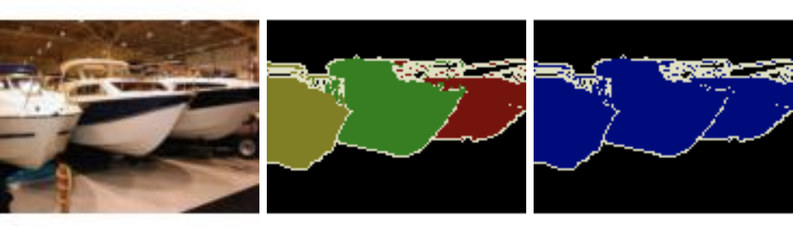

---

# Method Overview

- Off the shelf super-pixel segmentation
- Compute similarity metrics between neigboring SPs
- overlay networks of neighbor similarity graphs, uniform value links

---

# Method Overview (continued)

- simulate traversal of graph (Markov)
- threshold traversal probabilities
- combine threshold-ed segmentation masks

---

# Similarity Metrics

---

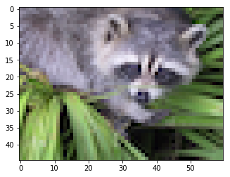{width=33%}
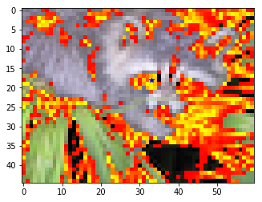{width=33%}
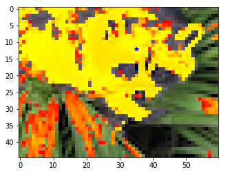{width=33%}

Left: original image. Middle: alpha similarity to starred pixel. Right: beta
similarity to starred pixel.

---

# Method Walkthrough

Divide image into superpixels with off the shelf method (such as SLIC).

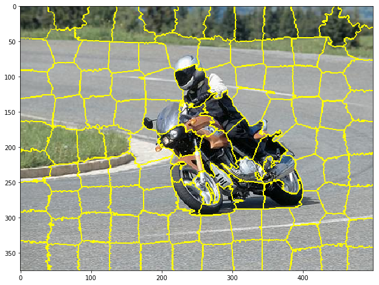{width=60%}

---

Compute similarity metrics between neigboring SPs;
overlay networks of neighbor similarity graphs, uniform value links.

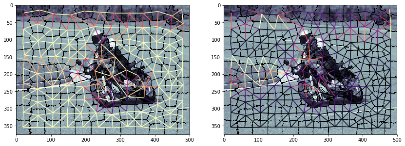

---

Simple segmentation by cutting edges under some threshold similarity. Left:
alpha only. Right: beta only.

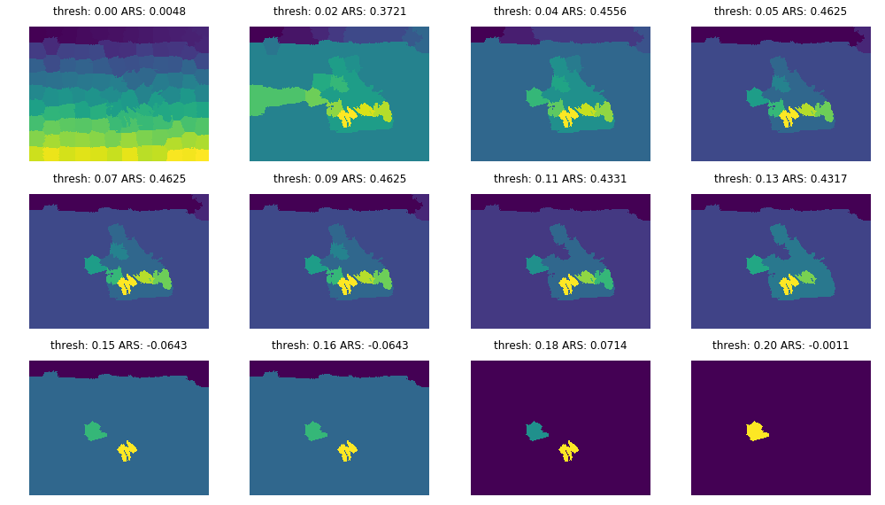{width=50%}
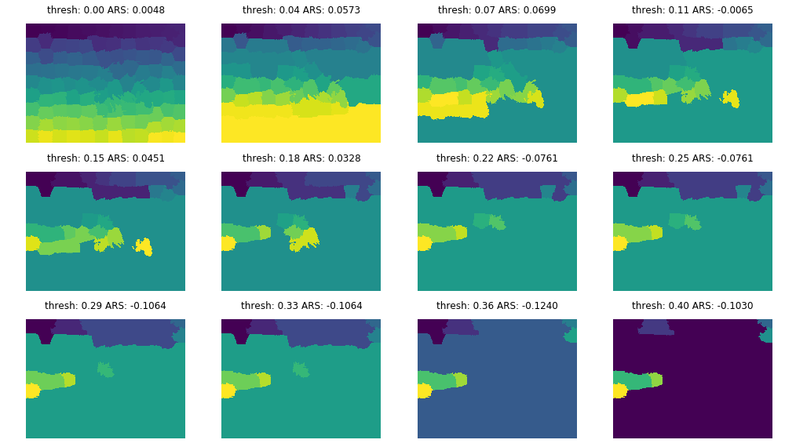{width=50%}

---

Simulate traversal of graph by taking the n-th power of the adjacency matrix;
threshold traversal probabilities to create binary segmentation masks.

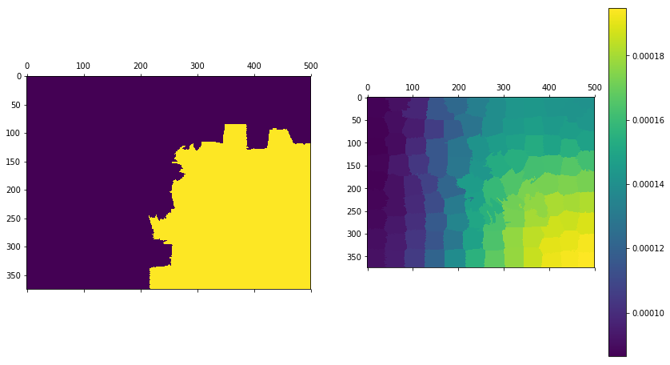

---

Threshold traversals from *all* source superpixels.

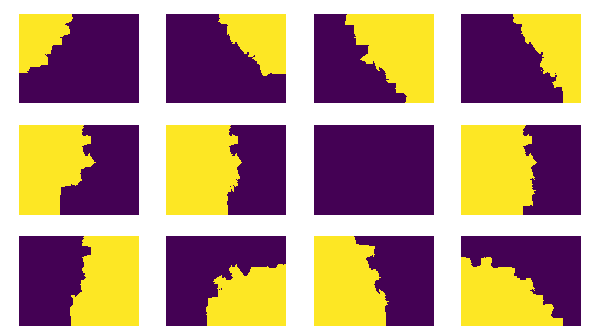

---

# Example Combined Segmentations

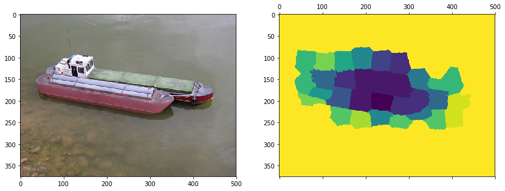

---

# Baseline for Comparison

- use off the shelf superpixel method (SLIC-Zero)
- cluster superpixels based on pixel similarity (k-Means, k=3)

---

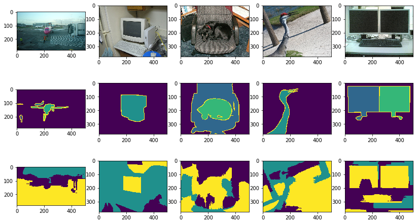

---

# Scoring

Normalized Probabilistic Rand (NPR) index[^npri]:

[^npri]: https://www.cs.cmu.edu/~hebert/segs.htm

---

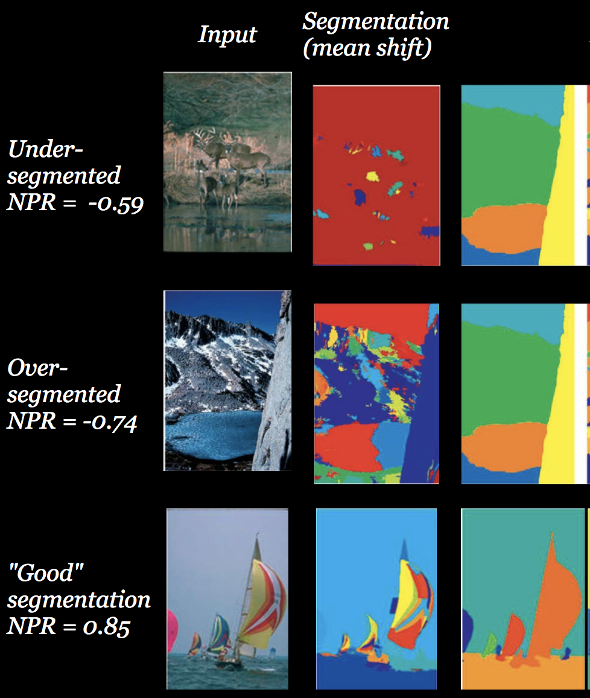

---

# Initial Results

Negative values indicate poor segmentation, higher is better.

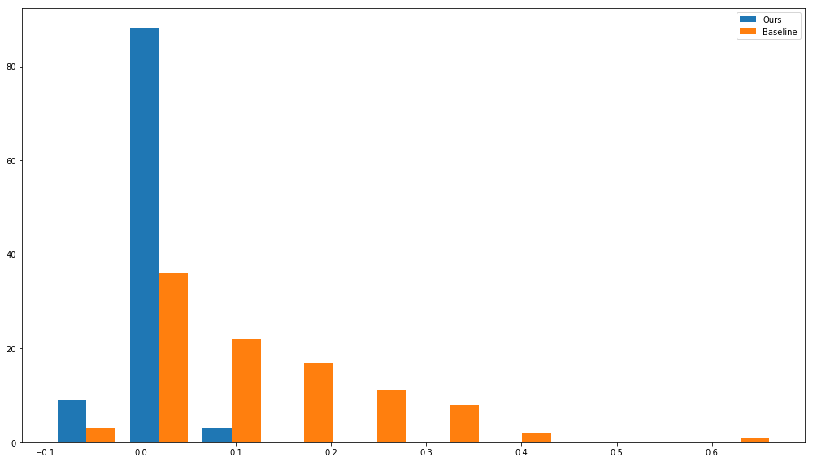{width=80%}

---

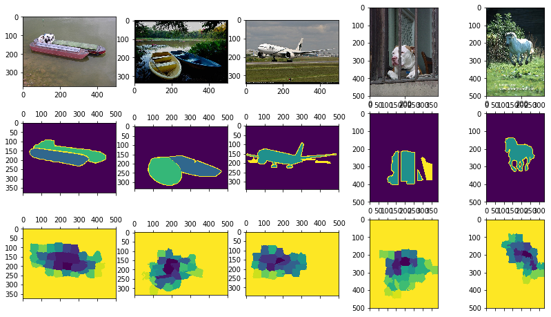{width=50%}
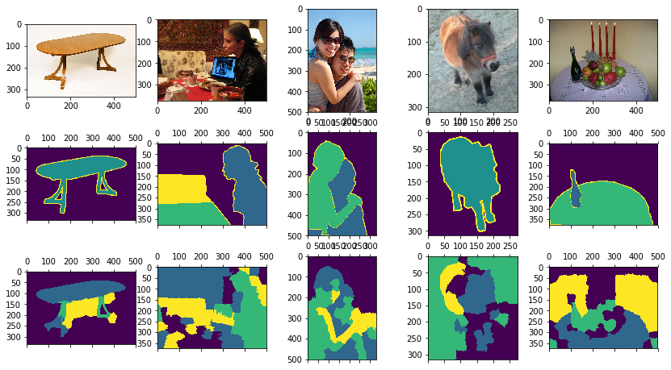{width=50%}

Left: best segmentations w/ our method.
Right: best segmentations w/ baseline method.

---

# TODO

- Full evaluation on PASCAL VOC dataset
- Find optimal threshold
- Explore different traversal horizons
- More!

---

# Questions?

On GitHub: 

\tiny
github.com/connorgreenwell/image_seg_interdep_epidemic
