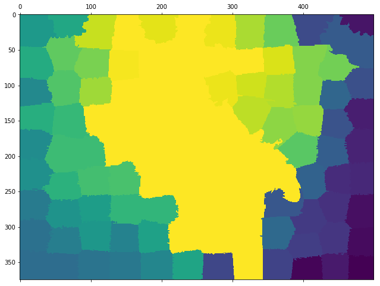

# Task Overview

---

# Method Overview

---

# Similarity Metrics

---

{width=33%}
{width=33%}
{width=33%}

---

# IDN

---

---

{width=50%}
{width=50%}

---

---

---

---

# Example Output

---

# Baseline for Comparison

---

---

# Scoring

---

# Results

---

---

# TODO

- foo
- bar
- baz

---

# Questions?
