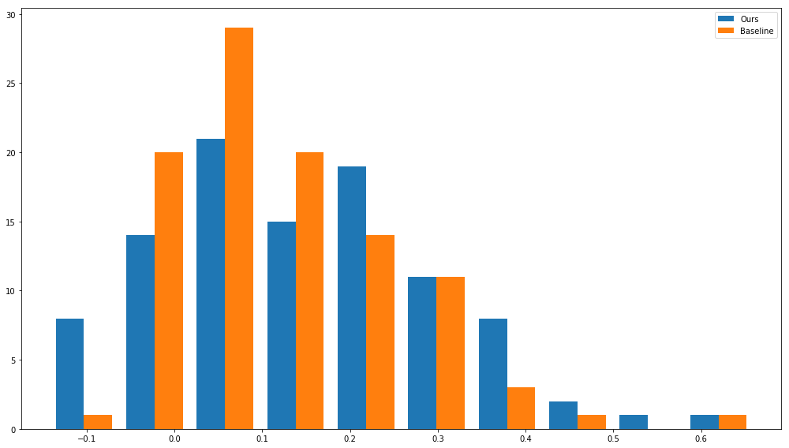

# Visual Object Segmentation 

Given an image, label each pixel as belonging to a separete physical object.
(Note: distinct from object classification)

---

# Method Overview

- Off the shelf super-pixel segmentation
- Compute similarity metrics between neigboring SPs
- overlay networks of neighbor similarity graphs, uniform value links

---

# Method Overview (continued)

- simulate traversal of graph (Markov)
- threshold traversal probabilities
- combine threshold-ed segmentation masks

---

# Similarity Metrics

- We want two or more distinct metrics for pixel similarity.
- These similarities will ultimately be used to generate network adjacency matrices

---

# Similarity Metrics (continued)

- For any pixel in this image, we want metrics that tell us how "similar" each other pixel is to it
- Pixels are represented as 3-vectors, with red, green, and blue components

---

# Alpha Method (Euclidean Value Difference)

- Take the inverse square of the difference in magnitude between every pair of pixels in the image
- Using the magnitude implicitly rejects color information
- Taking the inverse square makes the resulting value decrease as the pixels become more different
- The result is a four-dimensional array or an "image of images"

---

# Beta Method (Cosine Hue Difference)

{width=33%} {width=33%} {width=33%}

- First subtract a vector constant from every pixel to center the color space around zero
- Then scale each vector by the inverse of its magnitude to reject value information
    - We've essentially reduced our point-cloud to a hollow sphere
    - Points on the surface of that sphere represent unique hues
- Now, take the dot product of every pair of pixels in the image
- The result is the cosine of the angular distance between the pixels on the hue-sphere
    - This metric decreases as the hues become more different

---

# Method Walkthrough

Divide image into superpixels with off the shelf method (such as SLIC).

{width=60%}

---

Compute similarity metrics between neigboring SPs;
overlay networks of neighbor similarity graphs, uniform value links.

---

Simple segmentation by cutting edges under some threshold similarity. Left:
alpha only. Right: beta only.

{width=50%}
{width=50%}

---

Simulate traversal of graph by taking the n-th power of the adjacency matrix;
threshold traversal probabilities to create binary segmentation masks.

---

Threshold traversals from *all* source superpixels.

---

# Example Combined Segmentations

---

# Baseline for Comparison

- use off the shelf superpixel method (SLIC-Zero)
- cluster superpixels based on pixel similarity (k-Means, k=3)

---

---

# Scoring

Normalized Probabilistic Rand (NPR) index[^npri]:

[^npri]: https://www.cs.cmu.edu/~hebert/segs.htm

---

---

# Initial Results

Negative values indicate poor segmentation, higher is better.

{width=80%}

---

{width=50%}
{width=50%}

Left: best segmentations w/ our method.
Right: best segmentations w/ baseline method.

---

# TODO

- Full evaluation on PASCAL VOC dataset
- Find optimal threshold
- Explore different traversal horizons
- More!

---

# Questions?

On GitHub: 

\tiny
github.com/connorgreenwell/image_seg_interdep_epidemic
